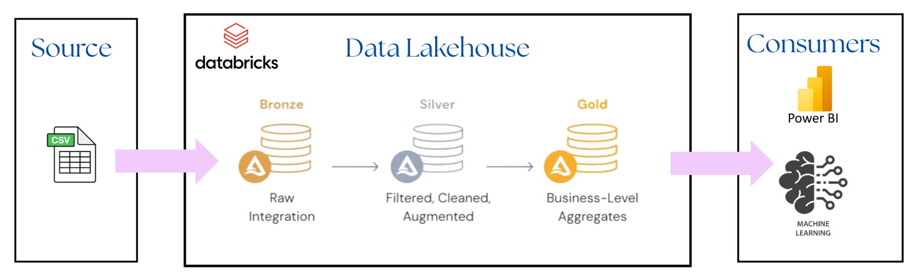
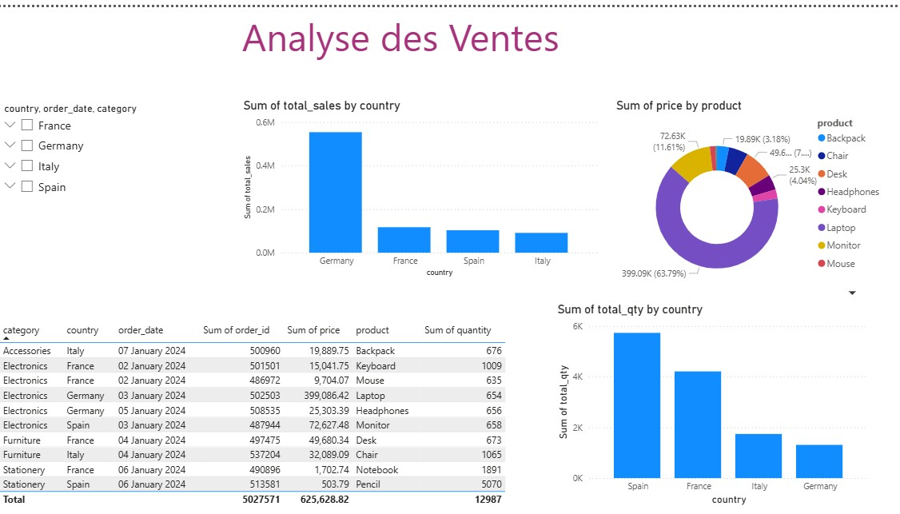

# data-engineering-sales-lakehouse

### 📋 Project Overview

This project implements a full Data Lakehouse architecture using Databricks, PySpark, and Power BI.
The goal is to build an end-to-end ETL pipeline (Bronze → Silver → Gold) that ingests a CSV file, transforms it, aggregates business metrics, and visualizes results in a Power BI dashboard.

Architecture


### 🛠 Technologies Used

- Databricks

- PySpark

- SQL

- Delta Lake

- Power BI

- Lakehouse Architecture

- Data Visualization

## 🏗️ Project Folder Structure
```
data-engineering-sales-lakehouse/
│
├── databricks/
│     ├── bronze_silver_gold_notebook.py
│     ├── sql_gold_layer.sql
│
├── powerbi/
│     ├── sales_dashboard.pbix
│
├── dataset/
│     ├── sample_sales.csv
│
├── diagrams/
│     ├── architecture.png
│     ├── dashboard_preview.png
│
└── README.md
```

### 🔄 ETL Pipeline


**1️⃣ Bronze Layer**

- Raw ingestion of CSV

- No transformations

- Saved as Delta table

**2️⃣ Silver Layer**

- Data cleaning (dropna)

- Date formatting

- Added calculated column total = price * quantity

**3️⃣ Gold Layer**

- Aggregation by:

  Country

  Product

  Order_date

- Metrics:

  Total_sales

  Total_qty

###  Code (Bronze → Silver → Gold)

**📘 Bronze – Ingestion**
```
df_bronze = (
    spark.read
    .format("csv")
    .option("header", True)
    .option("inferSchema", True)
    .load("/Volumes/demo_catalog/raw/sales_volume/sales_large.csv")
)

df_bronze.write.mode("overwrite").saveAsTable("demo_catalog.raw.bronze_sales")
```
**📙 Silver – Cleaning & Transformations**
```
from pyspark.sql.functions import col, to_date

df_silver = (
    df_bronze
    .withColumn("order_date", to_date(col("order_date"), "yyyy-MM-dd"))
    .withColumn("total", col("price") * col("quantity"))
    .dropna()
)

df_silver.write.mode("overwrite").saveAsTable("demo_catalog.raw.silver_sales")
```
**📒 Gold – Business Aggregations**

```
CREATE OR REPLACE TABLE demo_catalog.raw.gold_sales AS
SELECT
    country,
    product,
    order_date,
    SUM(total) AS total_sales,
    SUM(quantity) AS total_qty
FROM demo_catalog.raw.silver_sales
GROUP BY country, product, order_date;
```
### 📊 Power BI Dashboard
The Power BI report includes:

📌 Total Sales by Country

📌 Revenue Distribution by Product

📌 Total Quantity by Country

📌 Transaction Details Table

These visuals provide clear business insights on sales performance across countries and products.



### 📬 Contact

👤 Your Name
📧 Email : hadirdriss6@gmail.com

💼 GitHub : https://github.com/hadirdriss

🔗 LinkedIn : https://www.linkedin.com/in/hadir-driss-287202206/
